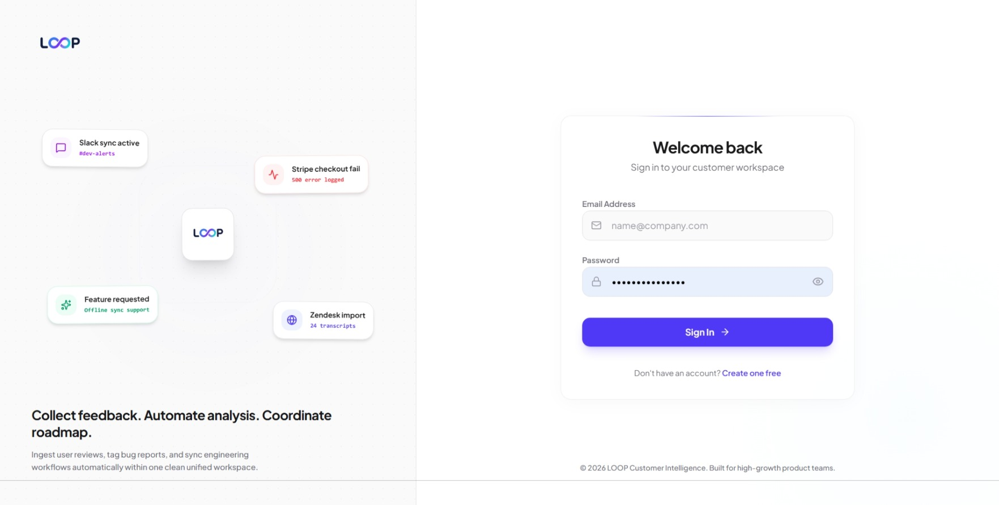
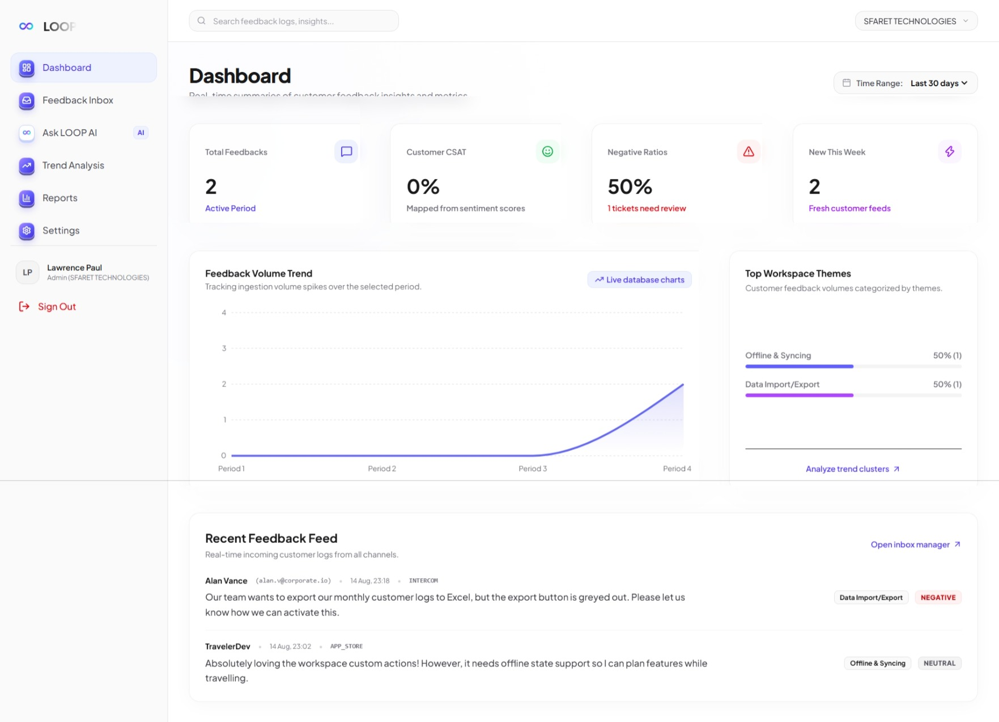
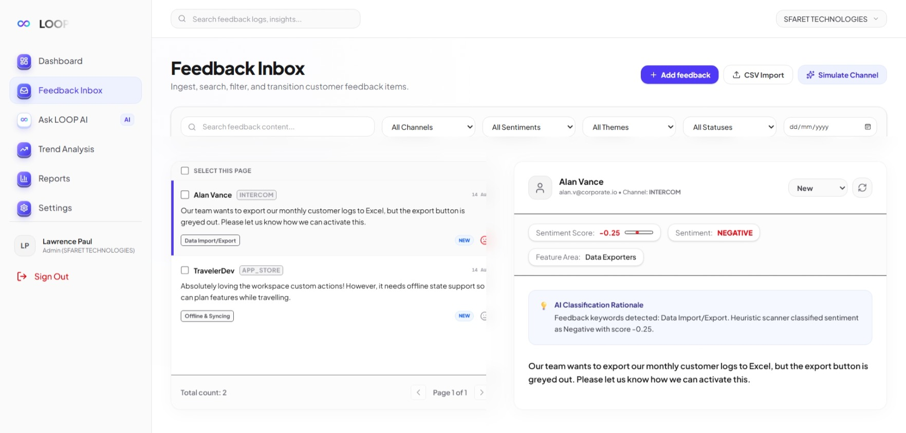

# LOOP — Customer Feedback Intelligence Platform

LOOP is a multi-tenant customer-feedback intelligence platform. Teams can bring feedback into one workspace, classify and organize it, monitor themes and sentiment, ask evidence-grounded questions, and create Voice-of-Customer (VoC) reports.

## Features

- Cookie-based authentication and protected application routes
- Isolated workspaces with Admin, Analyst, and Viewer roles
- Manual feedback entry, CSV import, and simulated feedback sources
- Automatic sentiment, feature-area, and theme classification
- Feedback inbox with status management and reclassification
- Dashboard analytics, theme clustering, and spiking-theme trends
- Ask LOOP: workspace-grounded feedback Q&A with cited evidence
- Voice-of-Customer report generation and print-to-PDF workflow
- Workspace profile and team invitation management

## Tech stack

| Area | Technology |
| --- | --- |
| Web app | Next.js 14 (App Router), React 18, TypeScript |
| UI | Tailwind CSS, Lucide React, Recharts |
| Database | PostgreSQL, Prisma ORM with `@prisma/adapter-pg` and `pg` |
| Authentication | Signed HTTP-only session cookie using Node.js `crypto` |
| AI | Anthropic Claude Messages API, with a local heuristic fallback |
| Deployment target | Vercel |

## Architecture

```text
Browser
  │
  ▼
Next.js App Router (pages + API route handlers)
  │
  ├── Authentication and RBAC
  │
  ├── Prisma ORM ──► PostgreSQL
  │
  └── AI helpers ──► Anthropic Claude API (optional)
```

All tenant-owned data is associated with a `workspaceId`. API handlers obtain the signed session, then scope reads and mutations to that workspace. Role checks are also enforced server-side: Admins manage members and workspace settings; Admins and Analysts can ingest, classify, update, and report on feedback; Viewers have read-only access.

Ask LOOP first retrieves feedback from the active workspace, then passes that context to Claude when an API key is available. The application falls back to local, keyword-based classification and response generation if the API key is absent or the request fails. LOOP does not currently use embeddings or pgvector.

## Project structure

```text
app/
  (auth)/                 Login and sign-up pages
  (app)/                  Authenticated product pages
  api/                    Route handlers for auth, feedback, analytics, AI, reports, and members
components/               Shared interface components
lib/                      Database, authentication, AI, and retrieval helpers
prisma/
  schema.prisma           PostgreSQL data model
  seed.ts                 Demo workspace and role accounts
public/                   Static images and product previews
```

## Prerequisites

- Node.js 18 or later
- npm
- PostgreSQL
- An Anthropic API key (optional; local AI fallbacks work without one)
- A Vercel account only if deploying to Vercel

## Local setup

1. Clone the repository and enter the project directory.

   ```bash
   git clone <repository-url>
   cd Loop
   ```

2. Install dependencies.

   ```bash
   npm install
   ```

3. Create a local environment file from the example.

   ```bash
   cp .env.example .env
   ```

   On PowerShell, use `Copy-Item .env.example .env` instead.

4. Set `DATABASE_URL` and `JWT_SECRET` in `.env`. Add `ANTHROPIC_API_KEY` to enable Claude-powered responses.

5. Apply the schema and generate the Prisma client.

   ```bash
   npx prisma db push
   npx prisma generate
   ```

6. Seed the demo workspace and accounts.

   ```bash
   npx tsx prisma/seed.ts
   ```

7. Start the development server at [http://localhost:3000](http://localhost:3000).

   ```bash
   npm run dev
   ```

To inspect the database locally, run `npx prisma studio`.

## Environment variables

| Variable | Required | Purpose |
| --- | --- | --- |
| `DATABASE_URL` | Yes | PostgreSQL connection string used by Prisma and the application |
| `JWT_SECRET` | Yes | Secret used to sign the session cookie; use a long unique value outside local development |
| `ANTHROPIC_API_KEY` | No | Enables Claude classification, Ask LOOP, and VoC generation |

Never commit `.env` or reuse a production secret in a demo environment.

## Database and demo data

The data model includes workspaces, users, invitations, feedback, themes, and reports. `prisma/seed.ts` creates one **Demo Company** workspace and the three accounts below. Run the seed command only against a disposable development database: the script creates a new workspace and duplicate emails will cause it to fail on later runs.

| Role | Email | Password |
| --- | --- | --- |
| Admin | `alice.admin@demo.test` | `password123` |
| Analyst | `andy.analyst@demo.test` | `password123` |
| Viewer | `vera.viewer@demo.test` | `password123` |

These credentials are sample accounts only. Do not use this password for any personal or production account.

## Screenshots

### Create account


### Login



### Dashboard



### Feedback Inbox



### Ask LOOP AI


## Deployment

1. Push the project to a Git provider and import it into Vercel.
2. Provision a PostgreSQL database and set `DATABASE_URL` in the Vercel project settings.
3. Add a strong `JWT_SECRET`; optionally add `ANTHROPIC_API_KEY`.
4. Deploy, then run the Prisma schema and seed commands against the deployment database only if demo data is intended.

Add the live deployment URL and demo video link here when they are available.

## Scope notes

LOOP provides simulated feedback channels; it does not include live Zendesk, Intercom, Discord, App Store, or social-media integrations. Billing, subscriptions, email/SMS delivery infrastructure, native mobile apps, vector embeddings, and pgvector search are outside the current scope.

## License and credits

This project was created as an internship submission. Claude is an Anthropic product; all referenced trademarks belong to their respective owners.
